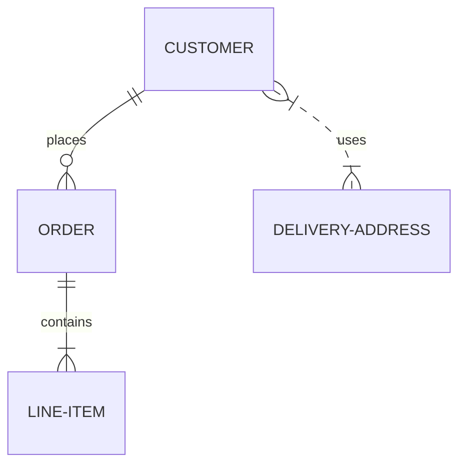

# Prepare

Collect, organize, validate. Decide what data is needed and how to get it.

## Why this phase matters

The Prepare phase controls everything downstream. Bad sourcing means bad analysis no matter how clever the model. Garbage in, garbage out.

## Data Collection Considerations

| Question | Why it matters |
|----------|----------------|
| How much data? | Affects sample size and analysis depth |
| What kind (qual/quant)? | Determines methods |
| First/second/third party? | Trust and access constraints |
| Time scope? | Recency vs. trend |
| Continuous or one-shot? | Pipeline vs. ad-hoc |
| Cost to acquire? | Budget vs. precision tradeoff |
| Refresh cadence? | Real-time vs. daily vs. monthly |

## ROCCC — good data

| Letter | Meaning | Bad data |
|--------|---------|----------|
| **R**eliable | Accurate, complete, unbiased | Selection bias, misleading graphs |
| **O**riginal | First-party / verified source | Secondary or third-party |
| **C**omprehensive | Covers needed scope | Partial / missing fields |
| **C**urrent | Up to date | Outdated, irrelevant |
| **C**ited | From credible, citable source | Uncited |

## Data parties

| Party | Description | Trust level |
|-------|-------------|-------------|
| **First-party** | Collected by your organization directly | Highest |
| **Second-party** | First-party data shared by a partner | Medium |
| **Third-party** | Aggregated or purchased | Lower; verify |

## Data Ethics

- **Ownership** — who owns the data
- **Transaction transparency** — clear collection/use
- **Consent** — informed agreement
- **Currency** — up-to-date status
- **Privacy** — preserve individual data subjects; permission and control
- **Openness** — free access, usage, sharing
- **Compliance** — GDPR, CCPA, HIPAA, SOX, PCI-DSS as applicable

## Data Types

| Type | Description | Example |
|------|-------------|---------|
| **Numerical** | Numbers, measurable | Quantity, price, age |
| **Text / String** | Letters, identifiers (no math) | Product name, address, ID |
| **Date** | Point in time | Order date, birth date |
| **Categorical** | Discrete groups | Color (red/blue), tier (gold/silver) |
| **Quantitative** | Measurable | Rating, upvote |
| **Qualitative** | Not measurable | Review text, interview |
| **Metadata** | Data about data | Schema, lineage, ownership |

## Long vs. wide format

| Long (tidy) | Wide |
|-------------|------|
| One observation per row | Multiple observations per row |
| One variable per column | Variables spread across columns |
| Easier for grouping, plotting | Easier for human reading |
| `pd.melt()` to convert wide → long | `pd.pivot()` to convert long → wide |

## Data Life Cycle

1. **Plan** — what data, who manages
2. **Capture** — collect from sources
3. **Manage** — store, secure, govern
4. **Analyze** — derive insight
5. **Archive** — long-term storage
6. **Destroy** — delete shared copies

## Databases (relational)



| Concept | Description |
|---------|-------------|
| **Primary key** | Unique value per row |
| **Foreign key** | Reference to PK in another table |
| **Index** | Speeds lookups on a column |
| **Constraint** | NOT NULL, UNIQUE, CHECK |
| **Schema** | Description of structure (tables, columns, types) |

## File Organization

- Folder depth ≤ 5
- Pick a style and stick to it
- File names should include:
  - Project name
  - Creation date (YYYY_MM_DD)
  - Revision version
  - Consistent style and order
- Example: `SalesReport_2026_03_15_v02`

## Storage decisions

| Need | Format / system |
|------|-----------------|
| Quick share / collaborative | Google Sheets, Airtable |
| Structured + queryable | Postgres, MySQL, BigQuery |
| Large columnar / analytical | Parquet, BigQuery, Snowflake, DuckDB |
| Raw + cheap | S3 / GCS / Azure Blob |
| Real-time | Kafka, Pub/Sub |
| Versioned files | Git LFS, DVC, lakeFS |

## Open data sources

- [data.gov](https://www.data.gov/)
- [census.gov/data](https://www.census.gov/data.html)
- [Open Data Network](https://www.opendatanetwork.com/)
- [Google Cloud Public Datasets](https://cloud.google.com/datasets)
- [Google Dataset Search](https://datasetsearch.research.google.com/)
- [UCI ML Repository](https://archive.ics.uci.edu/)
- [Kaggle Datasets](https://www.kaggle.com/datasets)

See [Resources → Datasets](../resources/datasets.md) for the full list.

## Sample size guidelines

- ≥ 30 rows from CLT (Central Limit Theorem) for stable mean
- Larger sample → narrower CI, smaller margin of error
- Stakes-driven: high-stakes decisions warrant larger samples
- For A/B tests, calculate required sample size up front using power analysis

## Checklist

```markdown
- [ ] Data sources identified and accessible
- [ ] Data downloaded and stored appropriately
- [ ] Schema understood (long/wide, columns, types)
- [ ] Sorted and filtered for relevance
- [ ] Credibility verified (ROCCC)
- [ ] Privacy / licensing constraints documented
- [ ] Deliverable: description of all data sources used
```

## References

- [Google Data Analytics — Prepare](https://www.coursera.org/learn/data-preparation)
- [Tidy Data — Hadley Wickham](https://vita.had.co.nz/papers/tidy-data.html)
- [DAMA-DMBOK 2](https://www.dama.org/cpages/body-of-knowledge)
- [GDPR overview](https://gdpr.eu/)
