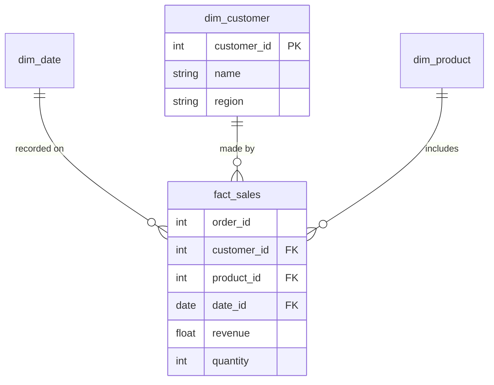

# Data Modeling

Data modeling is the process of structuring data to support business analysis and reporting. As a data analyst, you will often query modeled data (like Star Schemas) or create your own transformed tables (using tools like `dbt`).

## Key Architectures

| Architecture | Description |
|--------------|-------------|
| **Data Warehouse** | Central repository of structured, cleansed data optimized for analytics (e.g., Snowflake, BigQuery). Uses schemas like Star or Snowflake. |
| **Data Lake** | Repository for raw, unstructured, or semi-structured data (e.g., S3, Google Cloud Storage). |
| **Data Lakehouse** | Combines the flexibility of a Data Lake with the management and structure of a Data Warehouse. |

## The Star Schema

The most common data modeling approach for analytics, developed by Ralph Kimball.

### Fact Tables
*   **What it is:** Stores quantitative data for analysis (metrics, measurements) and foreign keys.
*   **Characteristics:** Very large, deeply granular, appended frequently.
*   **Examples:** `orders`, `pageviews`, `transactions`.

### Dimension Tables
*   **What it is:** Stores descriptive attributes related to the facts. Used for filtering and grouping (`WHERE` and `GROUP BY`).
*   **Characteristics:** Smaller, wider (many columns), updated less frequently.
*   **Examples:** `customers`, `products`, `date_dim`.

## ETL vs. ELT

*   **ETL (Extract, Transform, Load):** Data is transformed *before* it is loaded into the warehouse. Common in older, on-premise databases where storage was expensive.
*   **ELT (Extract, Load, Transform):** Data is loaded raw into the warehouse, and then transformed using the processing power of the warehouse itself. This is the modern standard (e.g., using `dbt` and BigQuery/Snowflake).

## Slowly Changing Dimensions (SCD)

How do you handle a dimension that changes over time (e.g., a customer moves to a new city)?

| Type | How it works | Pros/Cons |
|------|--------------|-----------|
| **Type 1** | Overwrite old data with new data. | Easy, but loses historical context. |
| **Type 2** | Add a new row with the new data, and use `valid_from` and `valid_to` dates. | Best for analytics; preserves history. |
| **Type 3** | Add a new column to the existing row (e.g., `previous_city`). | Rarely used; limited history. |

## References
*   [The Data Warehouse Toolkit (Kimball)](https://www.kimballgroup.com/data-warehouse-business-intelligence-resources/books/data-warehouse-dw-toolkit/)
*   [dbt Learn - Fundamentals](https://courses.getdbt.com/collections)
