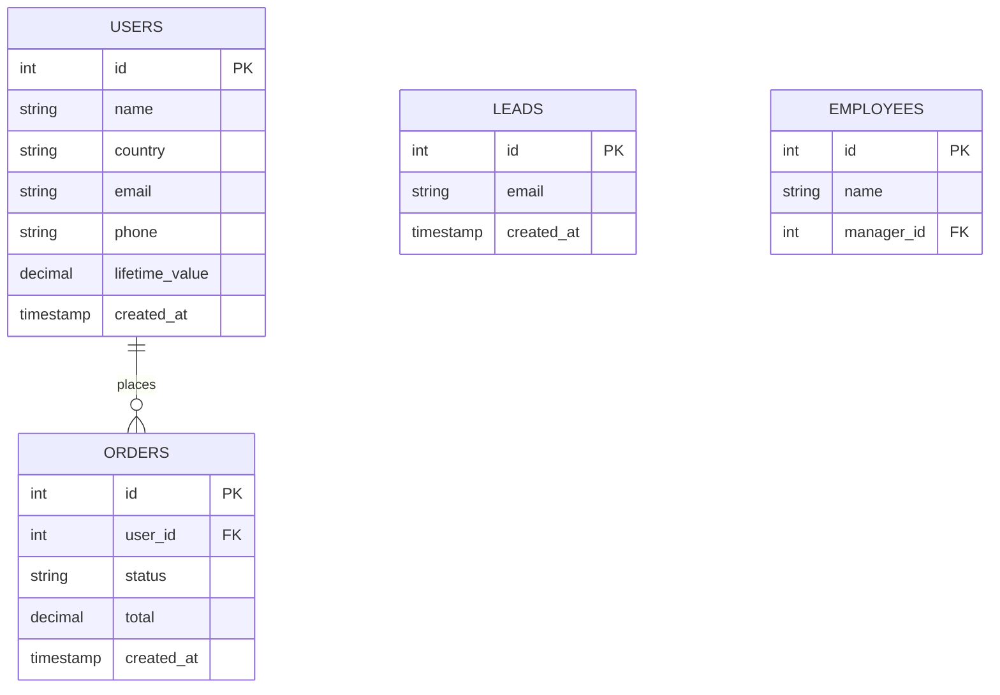

# SQL Fundamentals

## Database diagram

Every example on this page queries the same toy schema. Read it once, refer back as needed.

### How to read this diagram

This is an **ER (entity-relationship) diagram** in Mermaid syntax. Conventions:

- **Each box is a table.** Bold name on top; columns listed below as `type name [PK|FK]`.
- **`PK`** = *primary key*. Uniquely identifies a row — no two rows share the same PK value.
- **`FK`** = *foreign key*. Column whose value is the PK of another table — the "join key" that says which row this one belongs to.
- **Line between two tables** = a relationship. The endpoint markers are **crow's-foot notation**:
    - `||` *exactly one*
    - `o|` *zero or one*
    - `}o` *zero or many*
    - `}|` *one or many*

    So `USERS ||--o{ ORDERS : places` reads "one user places zero-or-many orders."
- **Self-loop** (`EMPLOYEES }o--o| EMPLOYEES : reports_to`) is a relationship into the same table — many employees report to zero-or-one manager (the CEO has none). Standard pattern for trees/hierarchies (employees ↔ manager, comments ↔ parent, categories ↔ subcategory).
- **No line ≠ unrelated.** `USERS.email` and `LEADS.email` aren't formally linked, but you can still match them as a set operation.

You'll see this schema referenced throughout the rest of the page.

## JOIN

JOINs let you combine rows from two tables on a related column. In our schema, the canonical example is `users` ⋈ `orders` ON `users.id = orders.user_id`.

  

    <button class="je-btn" data-join="inner"      aria-pressed="true">INNER</button>
    <button class="je-btn" data-join="left"       aria-pressed="false">LEFT</button>
    <button class="je-btn" data-join="right"      aria-pressed="false">RIGHT</button>
    <button class="je-btn" data-join="full"       aria-pressed="false">FULL OUTER</button>
    <button class="je-btn" data-join="left_excl"  aria-pressed="false">LEFT EXCLUSIVE</button>
    <button class="je-btn" data-join="right_excl" aria-pressed="false">RIGHT EXCLUSIVE</button>
    <button class="je-btn" data-join="full_excl"  aria-pressed="false">FULL EXCLUSIVE</button>
    <button class="je-btn" data-join="cross"      aria-pressed="false">CROSS</button>
    <button class="je-btn" data-join="self"       aria-pressed="false">SELF</button>
  

  

    <svg class="je-venn" viewBox="0 0 280 160" role="img" aria-labelledby="je-title je-desc">
      <title id="je-title">Two-set Venn diagram for SQL joins</title>
      <desc id="je-desc">Highlighted region updates when a JOIN type is selected.</desc>
      <defs>
        <clipPath id="je-clip-a"><circle cx="110" cy="80" r="50"/></clipPath>
        <clipPath id="je-clip-b"><circle cx="170" cy="80" r="50"/></clipPath>
        <mask id="je-mask-not-b" maskUnits="userSpaceOnUse" x="0" y="0" width="280" height="160">
          <rect width="280" height="160" fill="white"/>
          <circle cx="170" cy="80" r="50" fill="black"/>
        </mask>
        <mask id="je-mask-not-a" maskUnits="userSpaceOnUse" x="0" y="0" width="280" height="160">
          <rect width="280" height="160" fill="white"/>
          <circle cx="110" cy="80" r="50" fill="black"/>
        </mask>
      </defs>

      <!-- highlight regions -->
      <circle data-region="a"  cx="110" cy="80" r="50" mask="url(#je-mask-not-b)" class="je-region"/>
      <circle data-region="ab" cx="110" cy="80" r="50" clip-path="url(#je-clip-b)" class="je-region"/>
      <circle data-region="b"  cx="170" cy="80" r="50" mask="url(#je-mask-not-a)" class="je-region"/>

      <!-- outlines -->
      <circle cx="110" cy="80" r="50" class="je-outline"/>
      <circle cx="170" cy="80" r="50" class="je-outline"/>

      <!-- labels -->
      <text x="78"  y="84" class="je-label">A</text>
      <text x="202" y="84" class="je-label">B</text>
    </svg>

    <svg class="je-grid" viewBox="0 0 280 160" role="img" aria-label="Cross join Cartesian product grid">
      <!-- column headers (B) -->
      <g class="je-grid-cell">
        <rect x="92"  y="22" width="40" height="26" rx="4"/>
        <rect x="138" y="22" width="40" height="26" rx="4"/>
        <rect x="184" y="22" width="40" height="26" rx="4"/>
        <text x="112" y="40" class="je-label">B1</text>
        <text x="158" y="40" class="je-label">B2</text>
        <text x="204" y="40" class="je-label">B3</text>
      </g>
      <!-- row headers (A) -->
      <g class="je-grid-cell">
        <rect x="40" y="56"  width="40" height="26" rx="4"/>
        <rect x="40" y="88"  width="40" height="26" rx="4"/>
        <rect x="40" y="120" width="40" height="26" rx="4"/>
        <text x="60" y="74"  class="je-label">A1</text>
        <text x="60" y="106" class="je-label">A2</text>
        <text x="60" y="138" class="je-label">A3</text>
      </g>
      <!-- product cells -->
      <g class="je-grid-prod">
        <rect x="92"  y="56"  width="40" height="26" rx="4"/>
        <rect x="138" y="56"  width="40" height="26" rx="4"/>
        <rect x="184" y="56"  width="40" height="26" rx="4"/>
        <rect x="92"  y="88"  width="40" height="26" rx="4"/>
        <rect x="138" y="88"  width="40" height="26" rx="4"/>
        <rect x="184" y="88"  width="40" height="26" rx="4"/>
        <rect x="92"  y="120" width="40" height="26" rx="4"/>
        <rect x="138" y="120" width="40" height="26" rx="4"/>
        <rect x="184" y="120" width="40" height="26" rx="4"/>
        <text x="112" y="74"  class="je-label">×</text>
        <text x="158" y="74"  class="je-label">×</text>
        <text x="204" y="74"  class="je-label">×</text>
        <text x="112" y="106" class="je-label">×</text>
        <text x="158" y="106" class="je-label">×</text>
        <text x="204" y="106" class="je-label">×</text>
        <text x="112" y="138" class="je-label">×</text>
        <text x="158" y="138" class="je-label">×</text>
        <text x="204" y="138" class="je-label">×</text>
      </g>
    </svg>

    <svg class="je-self" viewBox="0 0 280 160" role="img" aria-label="Self join: same table joined under two aliases">
      <text x="140" y="22" class="je-label" style="font-size:10px; letter-spacing:.06em">SAME TABLE · TWO ALIASES</text>
      <circle cx="100" cy="82" r="42" class="je-region" style="opacity:.55"/>
      <circle cx="180" cy="82" r="42" class="je-region" style="opacity:.55"/>
      <circle cx="100" cy="82" r="42" class="je-outline"/>
      <circle cx="180" cy="82" r="42" class="je-outline"/>
      <text x="100" y="86" class="je-label">t1</text>
      <text x="180" y="86" class="je-label">t2</text>
      <path d="M 100 132 Q 140 152 180 132" class="je-self-link"/>
      <text x="140" y="152" class="je-label" style="font-size:10px">= one table</text>
    </svg>
  

  

    

      INNER JOIN
      BEGINNER
    

    
A ∩ B  ·  matches in both

    
Returns only rows whose key exists in <em>both</em> tables.

    <pre class="je-sql"><code data-field="sql">SELECT *
FROM   a
INNER JOIN b ON a.id = b.a_id;</code></pre>
  

## SELECT basics

Pick rows or columns from a table. Click each variant to see what changes.

  

    <button class="sx-btn" data-variant="all"      aria-pressed="true">SELECT *</button>
    <button class="sx-btn" data-variant="cols"     aria-pressed="false">columns</button>
    <button class="sx-btn" data-variant="distinct" aria-pressed="false">DISTINCT</button>
    <button class="sx-btn" data-variant="limit"    aria-pressed="false">LIMIT</button>
  

  

    
Input · users

    

    
↓

    
Result

    

  

  

    

    

    

    <pre class="sx-sql"><code data-field="sql"></code></pre>
  

## WHERE filters

Filter rows by condition. Highlighted rows match the predicate.

  

    <button class="sx-btn" data-variant="equals"  aria-pressed="true">=</button>
    <button class="sx-btn" data-variant="and"     aria-pressed="false">AND</button>
    <button class="sx-btn" data-variant="like"    aria-pressed="false">LIKE</button>
    <button class="sx-btn" data-variant="in"      aria-pressed="false">IN</button>
    <button class="sx-btn" data-variant="between" aria-pressed="false">BETWEEN</button>
    <button class="sx-btn" data-variant="isnull"  aria-pressed="false">IS NULL</button>
    <button class="sx-btn" data-variant="notnull" aria-pressed="false">IS NOT NULL</button>
  

  

    
Input · users (highlighted = match)

    

  

  

    

    

    

    <pre class="sx-sql"><code data-field="sql"></code></pre>
  

## Aggregation

Roll many rows up into summary numbers with `GROUP BY`.

  

    <button class="sx-btn" data-variant="count"     aria-pressed="true">COUNT(*)</button>
    <button class="sx-btn" data-variant="distinct"  aria-pressed="false">COUNT(DISTINCT)</button>
    <button class="sx-btn" data-variant="sum"       aria-pressed="false">SUM</button>
    <button class="sx-btn" data-variant="avg"       aria-pressed="false">AVG</button>
    <button class="sx-btn" data-variant="min"       aria-pressed="false">MIN</button>
    <button class="sx-btn" data-variant="max"       aria-pressed="false">MAX</button>
    <button class="sx-btn" data-variant="group"     aria-pressed="false">GROUP BY</button>
    <button class="sx-btn" data-variant="having"    aria-pressed="false">HAVING</button>
  

  

    
Input · orders

    

    
↓

    
Result

    

  

  

    

    

    

    <pre class="sx-sql"><code data-field="sql"></code></pre>
  

## CASE expressions

Conditional logic inline — bucket values into categories.

  

    <button class="sx-btn" data-variant="simple"   aria-pressed="true">2 buckets</button>
    <button class="sx-btn" data-variant="nested"   aria-pressed="false">3 buckets</button>
    <button class="sx-btn" data-variant="null_safe" aria-pressed="false">NULL-safe</button>
  

  

    
Input · orders

    

    
↓

    
Result · adds a segment column

    

  

  

    

    

    

    <pre class="sx-sql"><code data-field="sql"></code></pre>
  

## Subqueries and CTEs

Same result, three readability shapes. Find orders from US users.

  

    <button class="sx-btn" data-variant="subquery" aria-pressed="true">subquery</button>
    <button class="sx-btn" data-variant="cte"      aria-pressed="false">CTE (WITH)</button>
    <button class="sx-btn" data-variant="multicte" aria-pressed="false">multi-CTE</button>
    <button class="sx-btn" data-variant="join"     aria-pressed="false">JOIN</button>
  

  

    

      

        
users

        

      

      

        
orders

        

      

    

    
↓

    
Result · orders from US users

    

  

  

    

    

    

    <pre class="sx-sql"><code data-field="sql"></code></pre>
  

## Window functions

Calculate over partitions <em>without</em> collapsing rows. Output gets one extra column.

  

    <button class="sx-btn" data-variant="row_number"    aria-pressed="true">ROW_NUMBER</button>
    <button class="sx-btn" data-variant="rank"          aria-pressed="false">RANK</button>
    <button class="sx-btn" data-variant="dense_rank"    aria-pressed="false">DENSE_RANK</button>
    <button class="sx-btn" data-variant="running_total" aria-pressed="false">running SUM</button>
    <button class="sx-btn" data-variant="lag"           aria-pressed="false">LAG</button>
    <button class="sx-btn" data-variant="lead"          aria-pressed="false">LEAD</button>
  

  

    
Input · orders

    

    
↓

    
Result · same rows, new column

    

  

  

    

    

    

    <pre class="sx-sql"><code data-field="sql"></code></pre>
  

## Set operations

Combine the rows of two queries — like Venn diagrams over result sets. Both queries must have the <em>same number and type</em> of columns.

  

    <button class="sx-btn" data-variant="union"     aria-pressed="true">UNION</button>
    <button class="sx-btn" data-variant="union_all" aria-pressed="false">UNION ALL</button>
    <button class="sx-btn" data-variant="intersect" aria-pressed="false">INTERSECT</button>
    <button class="sx-btn" data-variant="except"    aria-pressed="false">EXCEPT</button>
  

  

    

      

        
users.email

        

      

      

        
leads.email

        

      

    

    
↓

    
Result

    

  

  

    

    

    

    <pre class="sx-sql"><code data-field="sql"></code></pre>
  

## Date functions (Postgres)

Manipulate timestamps and intervals. Reference row: `created_at = '2025-03-15 14:30:00'`, "today" = `2026-05-10`.

  

    <button class="sx-btn" data-variant="current_date"  aria-pressed="true">CURRENT_DATE</button>
    <button class="sx-btn" data-variant="now"           aria-pressed="false">NOW()</button>
    <button class="sx-btn" data-variant="trunc_month"   aria-pressed="false">DATE_TRUNC month</button>
    <button class="sx-btn" data-variant="trunc_year"    aria-pressed="false">DATE_TRUNC year</button>
    <button class="sx-btn" data-variant="extract_year"  aria-pressed="false">EXTRACT year</button>
    <button class="sx-btn" data-variant="extract_month" aria-pressed="false">EXTRACT month</button>
    <button class="sx-btn" data-variant="age"           aria-pressed="false">AGE()</button>
    <button class="sx-btn" data-variant="interval"      aria-pressed="false">- INTERVAL</button>
  

  

    
Input · users

    

    
↓

    
Result

    

  

  

    

    

    

    <pre class="sx-sql"><code data-field="sql"></code></pre>
  

